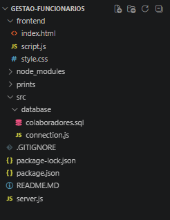
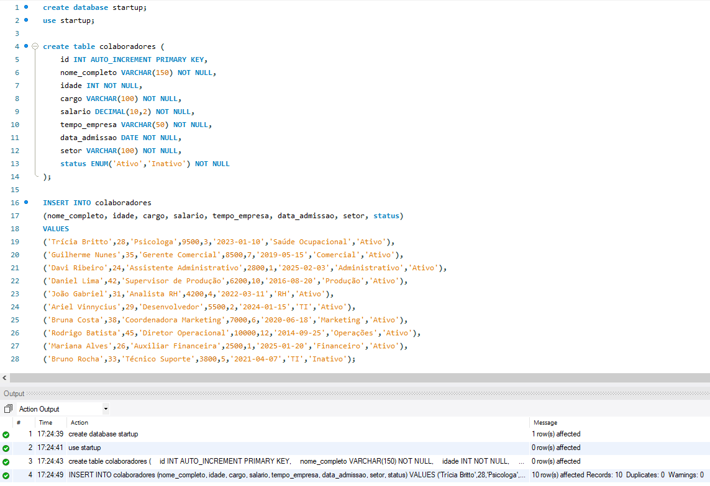
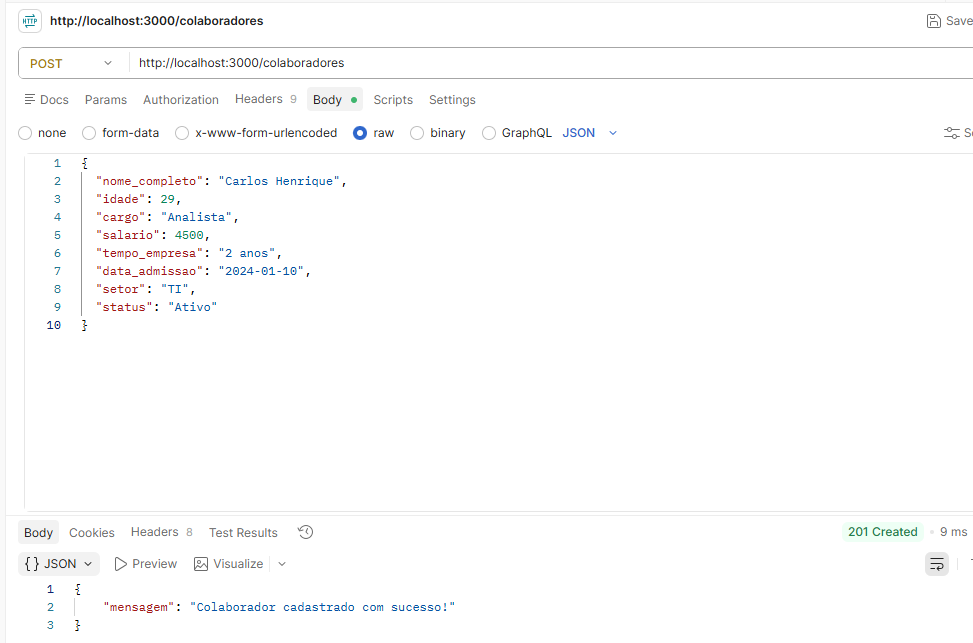
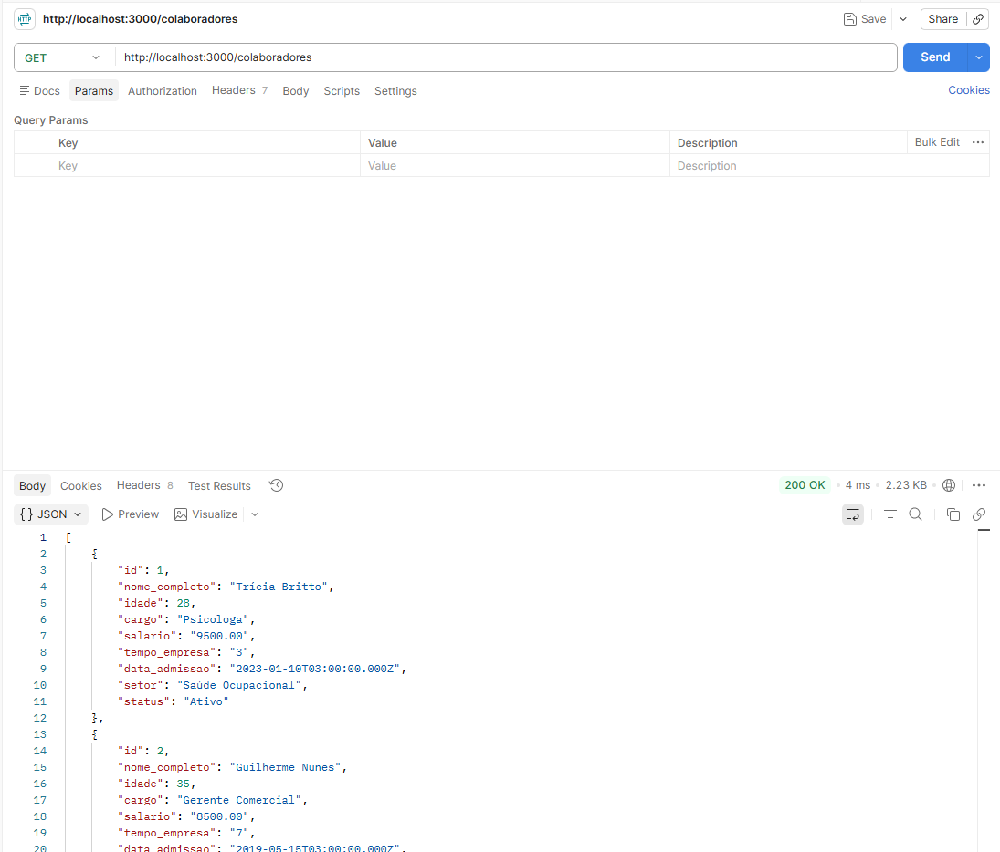
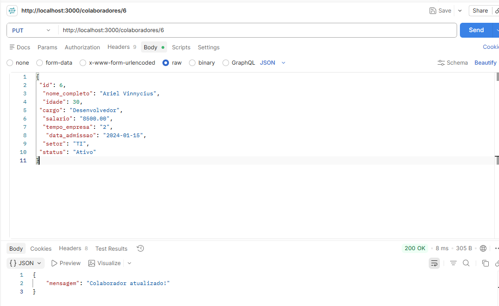
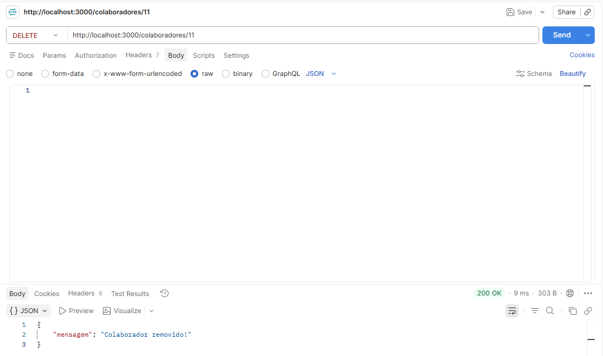
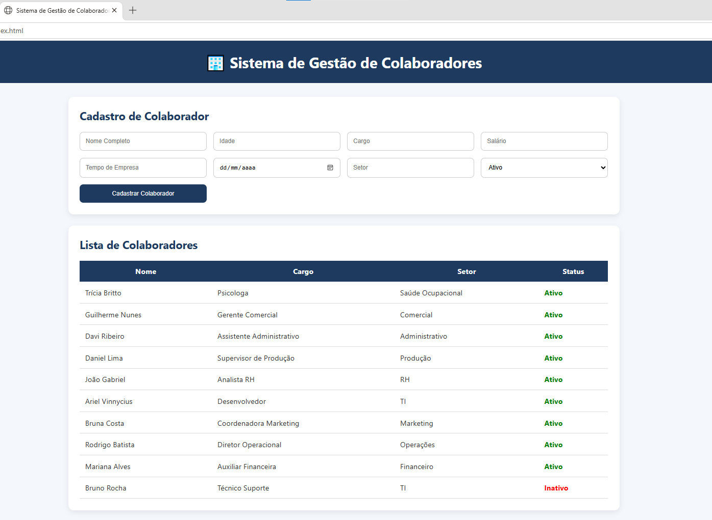

# 🏢 Sistema de Gestão de Colaboradores

## 👩‍💻 Desenvolvido por

**Trícia Britto**

---

## 📋 Descrição do Projeto

O Sistema de Gestão de Colaboradores é uma aplicação web desenvolvida para gerenciar informações de funcionários de uma empresa.

O sistema permite realizar operações de cadastro, consulta, atualização e remoção de colaboradores através de uma API REST integrada ao banco de dados MySQL.

O objetivo do projeto é aplicar conceitos de desenvolvimento backend e frontend, utilizando Node.js, Express, MySQL e Fetch API para criar uma solução completa e funcional.

---

## 🎯 Objetivo

Desenvolver uma API REST para gerenciamento de colaboradores, permitindo:

* Cadastro de colaboradores
* Listagem de colaboradores
* Atualização de colaboradores
* Exclusão de colaboradores
* Persistência de dados em banco MySQL
* Integração entre frontend e backend

---

## 🚀 Tecnologias Utilizadas

### Backend

* Node.js
* Express
* MySQL2
* Cors

### Frontend

* HTML5
* CSS3
* JavaScript
* Fetch API

### Ferramentas

* MySQL Workbench
* Postman
* Git
* GitHub
* Visual Studio Code

---

## 📂 Estrutura do Projeto

```text
GESTAO-FUNCIONARIOS/
│
├── frontend/
│   ├── index.html
│   ├── style.css
│   └── script.js
│
├── prints/
│
├── src/
│   └── database/
│       ├── connection.js
│       └── colaboradores.sql
│
├── server.js
├── package.json
├── package-lock.json
├── .gitignore
└── README.md
```

---

## 👥 Estrutura da Entidade Colaborador

A aplicação utiliza a entidade obrigatória **Colaborador**.

| Campo         | Tipo                    |
| ------------- | ----------------------- |
| id            | INT                     |
| nome_completo | VARCHAR(150)            |
| idade         | INT                     |
| cargo         | VARCHAR(100)            |
| salario       | DECIMAL(10,2)           |
| tempo_empresa | VARCHAR(50)             |
| data_admissao | DATE                    |
| setor         | VARCHAR(100)            |
| status        | ENUM('Ativo','Inativo') |

---

## 🔗 Rotas da API

### ➕ POST - Cadastrar Colaborador

```http
POST /colaboradores
```

---

### 📄 GET - Listar Colaboradores

```http
GET /colaboradores
```

---

### ✏️ PUT - Atualizar Colaborador

```http
PUT /colaboradores/:id
```

---

### 🗑️ DELETE - Remover Colaborador

```http
DELETE /colaboradores/:id
```

---

## 💾 Banco de Dados

Banco de dados:

```sql
empresa
```

Tabela principal:

```sql
colaboradores
```

O sistema foi populado com colaboradores fictícios para simular uma equipe real de trabalho.

---

## ▶️ Como Executar o Projeto

### 1. Clonar o repositório

```bash
git clone URL_DO_REPOSITORIO
```

### 2. Acessar a pasta do projeto

```bash
cd GESTAO-FUNCIONARIOS
```

### 3. Instalar as dependências

```bash
npm install
```

### 4. Criar o banco de dados

Executar o script:

```text
src/database/colaboradores.sql
```

no MySQL Workbench.

### 5. Configurar a conexão com o MySQL

Arquivo:

```text
src/database/connection.js
```

Exemplo:

```javascript
host: "localhost",
user: "root",
password: "",
database: "empresa"
```

### 6. Iniciar o servidor

```bash
npm start
```

Servidor disponível em:

```text
http://localhost:3000
```

### 7. Executar o Frontend

Abrir o arquivo:

```text
frontend/index.html
```

no navegador.

---

## 🧪 Testes da API

Todas as rotas foram testadas utilizando o Postman.

### Rotas testadas

* POST
* GET
* PUT
* DELETE

---

# 📸 Evidências do Projeto

## 📁 Estrutura do Projeto

Print da organização das pastas e arquivos do sistema.

```text
prints/estrutura-projeto.png
```



---

## 🗄️ Banco de Dados MySQL

Print da tabela colaboradores contendo os registros cadastrados.

```text
prints/mysql.png
```



---

## 📥 Requisição POST

Cadastro de um novo colaborador utilizando o Postman.

```text
prints/postman-post.png
```



---

## 📤 Requisição GET

Listagem de todos os colaboradores cadastrados.

```text
prints/postman-get.png
```



---

## ✏️ Requisição PUT

Atualização dos dados de um colaborador.

```text
prints/postman-put.png
```



---

## 🗑️ Requisição DELETE

Exclusão de um colaborador.

```text
prints/postman-delete.png
```



---

## 💻 Tela do Sistema

Interface principal do Sistema de Gestão de Colaboradores.

```text
prints/tela-sistema.png
```



---

## ✅ Funcionalidades Implementadas

* Cadastro de colaboradores
* Listagem de colaboradores
* Atualização de dados
* Exclusão de colaboradores
* Integração com banco MySQL
* API REST completa
* Interface web responsiva
* Consumo da API utilizando Fetch API
* Persistência de dados

---

## 📚 Aprendizados

Durante o desenvolvimento deste projeto foram aplicados conceitos de:

* APIs REST
* CRUD
* Integração Frontend e Backend
* Banco de Dados Relacional
* MySQL
* Node.js
* Express
* Consumo de APIs com Fetch
* Versionamento com Git e GitHub

---

## 📄 Licença

Projeto acadêmico desenvolvido para fins educacionais.

**Sistema de Gestão de Colaboradores © 2026**

Desenvolvido por **Trícia Britto**
